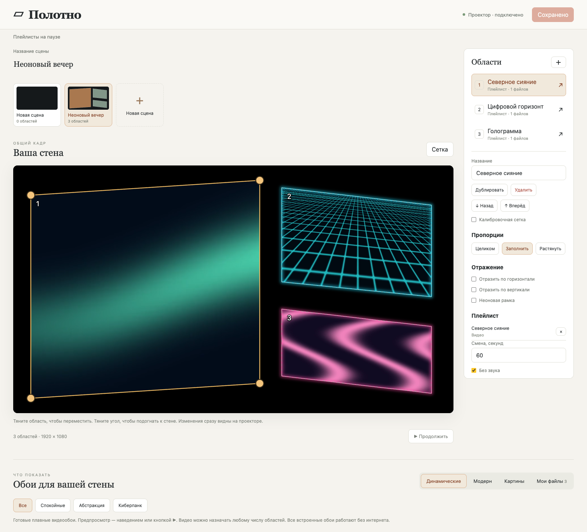

# Polotno · Полотно

**Turn a blank wall into your own living gallery.**

Art, moving wallpapers, and neon scenes — arranged to fit your room. Polotno lets you project photos and videos into separate areas, shape each one to your wall, and control the whole composition from your phone or laptop.

Free and open source. No subscription or cloud account. Save a scene, close your browser, and let the projector keep playing. Your media lives on the projector; your phone is just the remote.



*The real browser editor, shown with a local demo scene using bundled wallpapers. The interface is currently in Russian.*

## Make the room your own

- **Fit the wall, not a fixed layout.** Add as many areas as your composition needs. Drag each area and its four corners to fit a wall, a frame, or a corner of the room.
- **Find a mood in a few clicks.** Start with 12 looping video wallpapers and 12 modern stills, including cyberpunk. Browse museum paintings or upload your own photos and videos.
- **Give every area its own playlist.** Mix pictures and clips, choose separate intervals, and save different scenes for different evenings.
- **Finish the look.** Add a neon border, adjust its color and glow, preserve or crop the image proportions, and mirror photos or videos in either direction.
- **Keep the gallery running on its own.** Saved scenes and media work without your phone, laptop, or internet connection. Pair a browser by QR whenever you want to change things.

## How to — in 5 steps

First, install the APK on your Android TV projector; see [Build and install](#build-and-install). Put your phone or computer on the same Wi-Fi network as the projector.

1. **Open Polotno.** Launch **Полотно** on the projector. On the first launch, it shows a pairing QR code. Use **Menu** on the remote to bring the code back later.
2. **Connect your browser.** Scan the QR with your phone camera. On a computer, open the displayed address and enter the six-digit code. Pairing stays saved in that browser.
3. **Choose what to show.** Pick **Динамические** (video wallpapers), **Модерн** (modern stills), or **Картины** (museum art), then press **Показать** (Show). Upload your own files under **Мои файлы** (My files).
4. **Fit it to your room.** Drag an area to move it and drag its corners to match the wall. Add more areas with **＋**. Use the calibration grid for alignment, then customize borders, proportions, reflection, and playlists.
5. **Save and enjoy.** Press **Сохранить сцену** (Save scene). You can close the browser: the projector keeps showing the gallery and restores the saved scene next time.

The remote also works: **← / →** switch saved scenes, **OK** pauses or resumes playlists, **Menu** toggles pairing, and **Back** exits.

## Current status

Polotno is a working prototype built for Android TV projectors and tested on the **XGIMI MoGo 3 Pro G0035**, running Android 14. Physical checks cover local playback, pairing, browser editing, media import, calibration grids, neon frames, and image/video reflection.

Video areas have no artificial count cap, but smooth playback depends on the projector and clip resolution. Six different 720p clips showed dropped frames on the tested MoGo. Use lighter clips for larger compositions; areas showing the same active video share a decoder and playback phase.

Uploads support a broad range of photo and video formats, including vertical media. Files are processed locally when needed, and originals are retained. The upload limit is 512 MiB per file. Unsupported or protected codecs return an error.

Android screensaver integration is implemented; automatic activation, Safari, and a one-hour playback test remain to be verified. Fades, gallery backup/restore, and dedicated screensaver-scene selection are still planned. See [hardware findings](docs/HARDWARE_FINDINGS.md) and the [device validation checklist](docs/DEVICE_VALIDATION.md) for the evidence and remaining work.

## Build and install

Requirements: Node.js 22.12+ and npm, Python 3, make, JDK 17 or 21, Rust 1.91.1 or later, Android SDK platform/build-tools 35, and NDK `27.0.12077973`.

```sh
rustup target add armv7-linux-androideabi aarch64-linux-android x86_64-linux-android
export ANDROID_HOME=/path/to/android-sdk
npm --prefix web ci
npm --prefix web run build
./gradlew :android:app:assembleDebug
```

The build packages the web editor and compiles Rust and FFmpeg/OpenH264 for ARMv7, ARM64, and x86_64. The tested MoGo reports **armeabi-v7a only**, so the ARMv7 library is essential.

Install the APK on your selected projector:

```sh
adb -s DEVICE install -r android/app/build/outputs/apk/debug/app-debug.apk
```

Use update installs to retain gallery data. The debug key is for development; for persistent personal use, keep a permanent signing key outside iCloud and reuse it for updates. Never uninstall the app to work around a signature mismatch.

### Run the checks

```sh
(cd web && npx playwright install chromium)
npm --prefix web test
npm --prefix web run test:e2e
cargo test --workspace --locked
cargo fmt --all -- --check
cargo clippy --workspace --all-targets --locked -- -D warnings
./gradlew :android:app:testDebugUnitTest :android:app:lintDebug
```

### Run the editor without a projector

After building the web editor:

```sh
cargo run --locked -p polotno-core --bin polotno-dev -- runtime
```

Open the pairing URL printed in the terminal. Press Enter to stop the server. Local data in `runtime/` is ignored by Git. Pairing uses HTTP on your trusted local network; do not expose this prototype server to the public internet.

## Under the hood

- **Kotlin + Media3:** Android lifecycle, remote controls, screensaver, and video playback.
- **OpenGL ES:** projective rendering, shared textures, neon frames, and rendering on demand.
- **Rust + Axum + SQLite:** embedded server, pairing, uploads, catalog, and persistent local storage.
- **TypeScript + React:** visual browser editor with live preview and scene selection.

The browser updates static textures once and video textures only when a new frame arrives. Projector video events are combined into one scene draw at up to 30 fps. Compatible H.264 SDR clips are remuxed without re-encoding, preserving lower frame rates for lighter playback.

The museum collection uses The Met API. The API also supports Art Institute of Chicago (`provider=aic`), whose image CDN was unavailable during the initial check. Bundled wallpapers are original, work offline, and can be regenerated with `python3 scripts/generate-wallpapers.py` (FFmpeg required). See [wallpaper sources](docs/WALLPAPERS.md).

For the implementation roadmap, see [PLAN.md](PLAN.md). Development contracts are in [AGENTS.md](AGENTS.md).

## License

[MIT](LICENSE). Dependency attribution and media-tool licensing are in [THIRD_PARTY_NOTICES.md](THIRD_PARTY_NOTICES.md). This independent project is not affiliated with XGIMI or Dil Studio.
